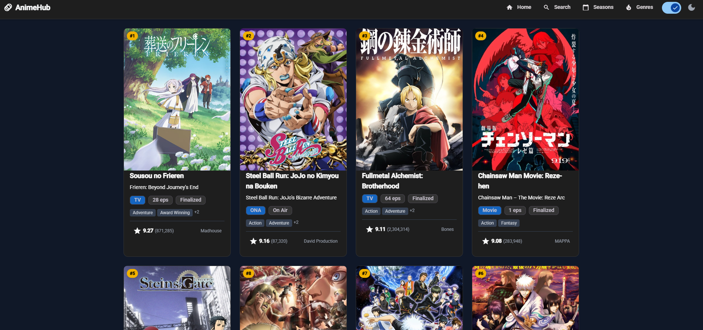

# 🎌 AnimeTracker — Angular App

Aplicación web desarrollada con **Angular** que muestra los animes más populares y los animes de la temporada actual. Ideal para seguir tus series favoritas y descubrir nuevos títulos.



> _Imagen ilustrativa de la interfaz de la aplicación._

---

## ✨ Características

- 🔥 **Animes más populares** – Lista actualizada con los títulos con mayor puntuación y seguidores.
- 🗓️ **Animes de la temporada actual** – Descubre qué se está emitiendo ahora mismo.
- 🔍 Búsqueda y filtros por género, estado, año, etc.
- 📱 Diseño responsive (mobile first).
- ⚡ Consumo de API externa (Jikan).

---

## 🛠️ Tecnologías utilizadas

- **Angular** (última versión LTS)
- **TypeScript**
- **Material UI**
- **API REST** (ej. [Jikan API](https://jikan.moe/))
- **RxJS** para manejo de datos asíncronos

---

## 🚀 Cómo ejecutar el proyecto localmente

1. Clona el repositorio:
   ```bash
   git clone https://github.com/nelsonacb/animes-project.git
   cd animes-project
   ```
